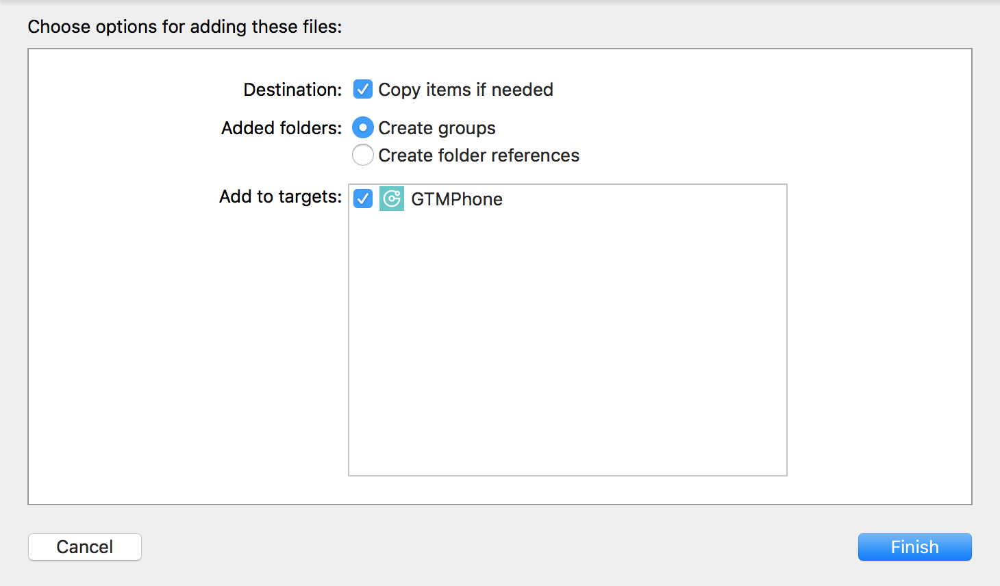
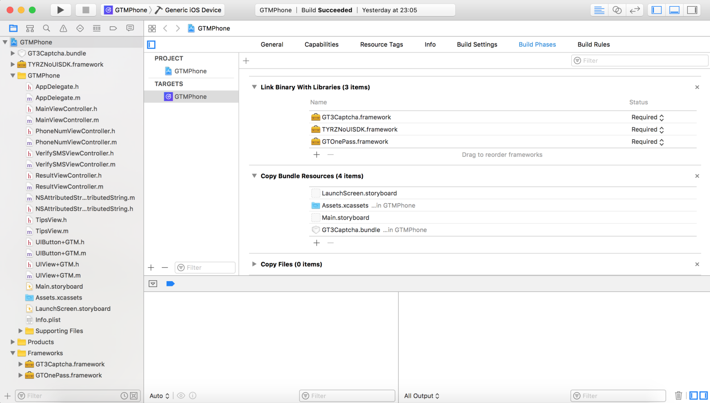
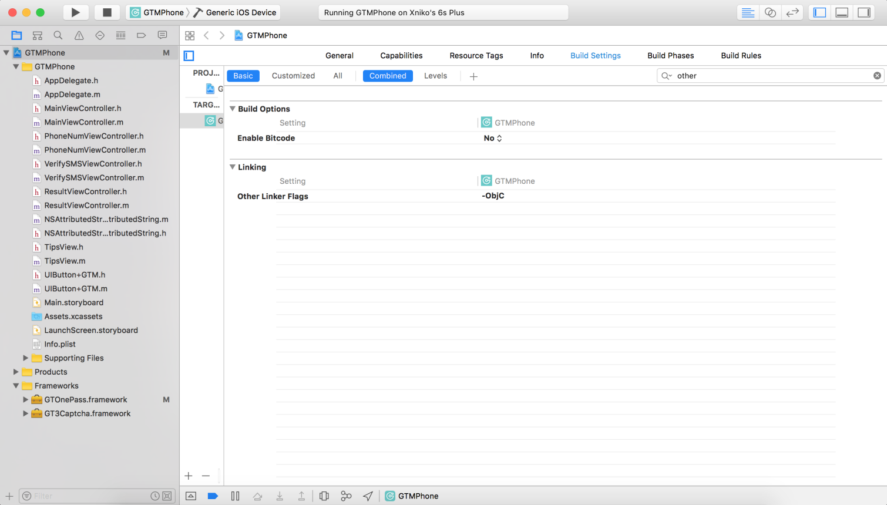
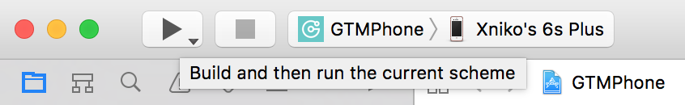

# GTOnePass iOS SDK

了解产品: [www.geetest.com](www.geetest.com)

需要拖入仓库`SDK`路径下的`GTOnePass.framework`, `TYRENoUISDK.framework` 2个文件

同时需要集成`Sensebot`产品的`GT3Captcha.framework`, `GT3Captcha.bundle`文件以获取相关参数。

# 概述及资源

## 环境需求

条目	|资源 			
------	|------------	
开发目标|兼容 iOS7, 推荐 iOS8+		
开发环境|Xcode 8.0	
系统依赖|`Webkit.framework`, `JavascriptCore.framework`
产品依赖|[Sensebot](http://docs.geetest.com/install/overview/)
SDK 三方依赖|无		

## 相关开发资料

条目|资源|
-------------	|--------------
SDK 下载			|[gop-ios-sdk](http://github.com/GeeTeam/gop-ios-sdk)
接口文档		|[gop-ios-header-docs](http://github.com/GeeTeam/gop-ios-sdk/blob/master/SDK/gop-ios-dev-doc.md) 或查看头文件注释
错误码			|[Error Code](http://github.com/GeeTeam/gop-ios-sdk/blob/master/SDK/gop-ios-dev-doc.md#errorcode)
产品结构流程  	|[交互流程](http://docs.geetest.com/onepass/overview/#交互流程),[通讯流程](http://docs.geetest.com/onepass/overview/#通讯流程)

# 安装

## 获取SDK

### 下载获取

```
git clone https://github.com/GeeTeam/gop-ios-sdk.git
```
或

```
git clone git@github.com:GeeTeam/gop-ios-sdk.git
```

## 导入SDK并配置环境

1. 将下载获取的`GTOnePass.framework`, `TYRZNoUISDK.framework`,`GT3Captcha.framework`及`GT3Captcha.bunele`4个文件拖拽到工程中, 确保`Copy items if needed`已被勾选。

	
	
	请使用`Linked Frameworks and Libraries`方式导入 framework。在拖入`GTOnePass.framework`,`TYRZNoUISDK.framework`和`GT3Captcha.framework`到工程后, 请检查`.framework`是否被添加到`PROJECT -> Build Phases -> Linked Frameworks and Libraries`, 以确保正常编译。
	
	

2. 针对静态库中的`Category`, 需要在对应 target 的`Build Settings`->`Other Linker Flags`添加`-ObjC`编译选项。如果依然有问题，再添加`-all_load`。

	

## 配置接口

开发者集成客户端 SDK 前, 必须先在您的服务器上搭建相应的**服务端 SDK**，配置`verify_Url`, 并配置从[极验后台](https://account.geetest.com/login)获取的`customID`。这里以服务端 `verify_Url` 配置成功，客户端开发步骤为例，如下：

1. 用 `verify_Url` 和 `customID` 初始化 GOPManager 实例

	```Objective-C
	GOPManager *manager = [[GOPManager alloc] initWithCustomID:customID verifyUrl:verify_Url timeout:5.0];
	```

2. 调用校验接口

	```Objective-C
	[self.manager verifyPhoneNum:@"输入的合法手机号" withCaptchaValidate:nil completion:^(NSDictionary *dict) {
	        
	    } failure:^(NSError *error) {
	        
	    }];
	``` 

>集成代码参考下方的**代码示例**

## 编译并运行你的工程

编译你的工程, 体验全新的极验 OnePass 产品！



轻轻点击集成的验证按钮, 如此自然, 如此传神。

# 代码示例

## 初始化与校验

在工程中的文件头部倒入静态库态库`GTOnePass.framework`

```objc
#import <GTOnePass/GOPManager.h>
#import <GT3Captcha/GT3Captcha.h>
```

### 初始化
	
初始化验证管理器`GOPManager`的实例, 在相应的控制页初始化方法中对`GOPManager `实例调用注册方法以获得注册数据:
	
```objc
//网站主部署的ONEPASS的校验接口
#define verify_url @"***"
...
	
- (GOPManager *)manager {
    if (!_manager) {
        _manager = [[GOPManager alloc] initWithCustomID:@"<---我应该为32位哟--->" configUrl:config_url verifyUrl:verify_url timeout:5.0];
    }
    
    return _manager;
}
```

### 进行 OnePass 校验
	
使用 `OnePass.framework` 接口方法 **`verifyPhoneNum:withCaptchaValidate:completion:failure:`** 对本机号码校验
	
```objc
- (void)verifyPhoneNum:(NSString *)num {
    
    // 自定义规则检测输入手机号码的合法性
    if (![self checkPhoneNumFormat:num]) return;
    
    // 调用 OnePass 校验接口
	[self.manager verifyPhoneNum:num withCaptchaValidate:nil completion:^(NSDictionary *dict) {
        ...
    } failure:^(NSError *error) {
        ...
    }];
}
```

> Note: 在 `verifyPhoneNum:withCaptchaValidate:completion:failure:` 方法中，`validate` 参数默认传值 nil。极验提供身份验证(OnePass) 和 人机验证(Sensebot)，当开发者只需部署身份验证时，`validate` 参数值传入 nil 即可；当开发者需结合部署人机验证和身份验证时，`validate` 参数值从人机验证成功返回结果中获得。如需结合部署人机验证和身份验证，请联系极验后台修改相应配置。

## 处理校验结果以及错误

OnePass 校验成功直接通过验证, 如果失败可以通过短信验证码作为补充。开发者可在 `OnePass.framework` 接口方法 **`verifyPhoneNum:withCaptchaValidate:completion:failure:`** 成功或者失败的回调中处理对应逻辑

```objc
NSString *num = @“校验后的合法手机号“;

[self.manager verifyPhoneNum:num withCaptchaValidate:nil completion:^(NSDictionary *dict) {
    NSString *type = [dict objectForKey:@"type"];
    if ([type isEqualToString:@"onepass"]) { // No sense Success
        // TODO OnePass 成功
    }
    else {
        // TODO OnePass 失败, 可使用短信验证作为补充
    }
} failure:^(NSError *error) {
    [self.nextButton gtm_removeIndicator];
    if (error.code != -999) { // 忽略-999
      // TODO 处理错误
    }
    NSLog(@"error: %@", error);
}];
```

>更加完整的示例代码请参考`GTMPhone`工程
